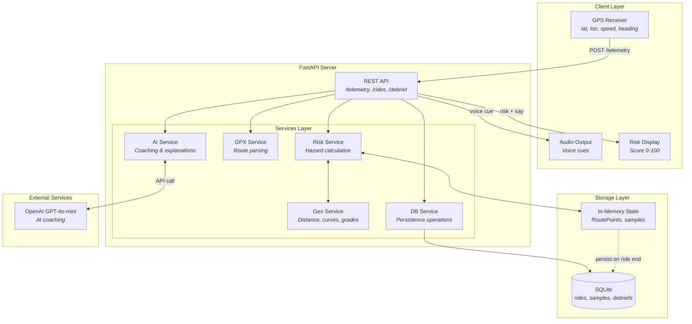
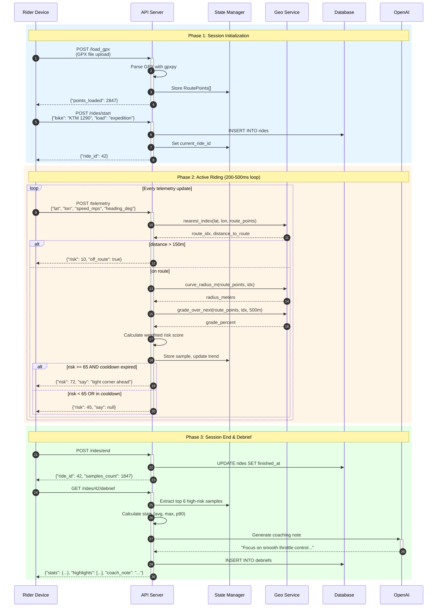
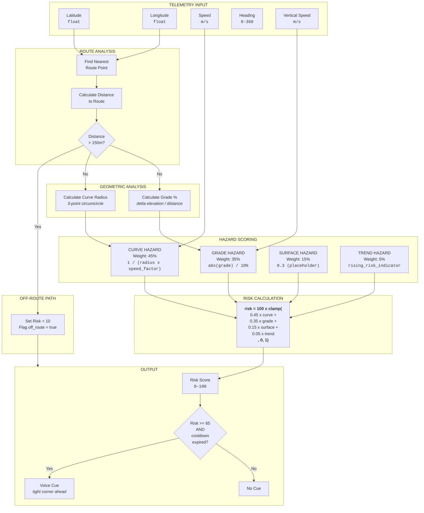
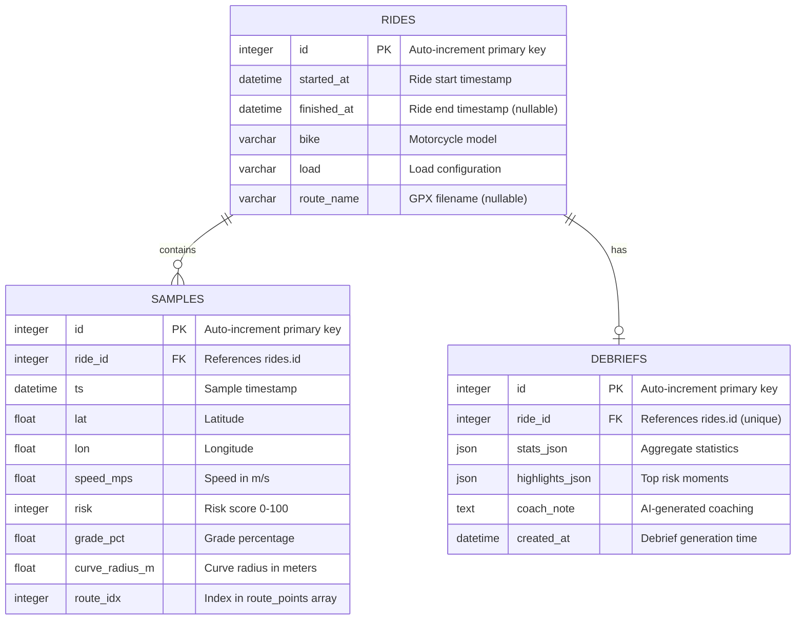

# CoNavigator

<div align="center">

**Real-Time Risk Assessment & AI Coaching for Adventure Motorcycle Riders**

[](https://www.python.org/downloads/)
[](https://fastapi.tiangolo.com/)
[](https://opensource.org/licenses/MIT)

*Navigate challenging terrain with confidence. Get real-time hazard warnings and post-ride coaching.*

</div>

---

## Table of Contents

- [Overview](#overview)
- [Key Features](#key-features)
- [System Architecture](#system-architecture)
- [How It Works](#how-it-works)
- [Risk Calculation Deep Dive](#risk-calculation-deep-dive)
- [API Reference](#api-reference)
- [Installation](#installation)
- [Configuration](#configuration)
- [Usage Guide](#usage-guide)
- [Database Schema](#database-schema)
- [Project Structure](#project-structure)
- [Generating Flowchart Images](#generating-flowchart-images)
- [Tech Stack](#tech-stack)
- [Roadmap](#roadmap)
- [Contributing](#contributing)
- [License](#license)

---

## Overview

**CoNavigator** is a comprehensive telemetry analysis system designed specifically for adventure (ADV) and dual-sport motorcycle riders tackling challenging off-road terrain. The system processes real-time GPS data, calculates dynamic risk scores based on multiple hazard factors, and delivers timely audio cues to help riders navigate safely.

### The Problem

Adventure riding involves constantly changing conditions—tight switchbacks, steep grades, loose surfaces, and technical terrain. Riders must process multiple hazards simultaneously while maintaining vehicle control. Fatigue and information overload can lead to poor decisions.

### The Solution

CoNavigator acts as a digital co-pilot that:

1. **Analyzes terrain geometry** using GPS coordinates and elevation data
2. **Calculates risk scores** based on curves, grades, and speed
3. **Delivers contextual voice cues** for upcoming hazards
4. **Provides AI-powered coaching** to improve riding technique over time

---

## Key Features

### Real-Time Risk Assessment
Continuous risk scoring on a 0-100 scale, updated every 200-500ms. The algorithm weighs multiple hazard factors including curve tightness, grade steepness, surface conditions, and rider fatigue indicators.

### Intelligent Voice Cues
Context-aware audio warnings triggered at risk thresholds. Cues describe the specific hazard and recommend appropriate action:
- *"Tight corner ahead—smooth throttle"*
- *"Steep grade—steady line"*
- *"Grade and corner—reduce speed"*

### Dual Operating Modes

| Mode | Description | Use Case |
|------|-------------|----------|
| **GPX Mode** | Load a planned route for lookahead hazard detection | Pre-planned adventures, known trails |
| **Free Mode** | Real-time assessment without a predefined route | Spontaneous rides, exploring new areas |

### AI-Powered Coaching
Post-ride debriefs powered by GPT-4o-mini analyze your highest-risk moments and provide personalized suggestions for technique improvement. The AI considers your bike type, load configuration, and riding patterns.

### Comprehensive Data Persistence
All rides, telemetry samples, and coaching notes are stored in SQLite for historical analysis and progress tracking.

---

## System Architecture

The following diagram illustrates how CoNavigator's components interact:



### Component Responsibilities

| Component | File | Purpose |
|-----------|------|---------|
| **REST API** | `api/app.py` | HTTP endpoints for telemetry, rides, and debriefs |
| **Risk Service** | `services/risk_service.py` | Core risk calculation algorithm |
| **Geo Service** | `services/geo_service.py` | Haversine distance, curve radius, grade calculation |
| **GPX Service** | `services/gpx_service.py` | Parse GPX files into RoutePoint lists |
| **AI Service** | `services/ai_service.py` | GPT integration for coaching and explanations |
| **DB Service** | `services/db_service.py` | SQLAlchemy operations wrapper |
| **Ride State** | `storage/ride_state.py` | In-memory state for active ride session |
| **Database** | `storage/database.py` | ORM models for rides, samples, debriefs |

---

## How It Works

### Complete Ride Session Flow

This sequence diagram shows the full lifecycle of a ride session:



### Operating Modes Explained

#### GPX Mode (Route-Based)

When a GPX file is loaded, CoNavigator gains **lookahead capability**:

1. **Route Matching**: Each telemetry point is matched to the nearest route point
2. **Curve Detection**: The algorithm looks ahead to detect upcoming curves using a 10-point window
3. **Grade Calculation**: Elevation changes are computed over the next 500m of route
4. **Off-Route Detection**: If the rider strays >150m from the route, they're flagged as off-route

#### Free Mode (No Route)

Without a GPX file, CoNavigator operates in **reactive mode**:

1. Uses only current speed and vertical velocity
2. Cannot detect upcoming hazards (curves, grades)
3. Simpler risk formula based on speed and climb/descent rate
4. Useful for spontaneous rides or exploring unmapped areas

---

## Risk Calculation Deep Dive

### The Risk Engine Flowchart



### Hazard Component Details

#### 1. Curve Hazard (45% weight)

The curve hazard uses the **circumcircle method** to estimate turn radius:

```
Given 3 consecutive route points A, B, C:
1. Calculate the circumradius of triangle ABC
2. Small radius = tight curve = high hazard

curve_hazard = clamp(SPEED_FACTOR / curve_radius, 0, 1)
```

| Radius | Hazard Level | Description |
|--------|--------------|-------------|
| < 50m | Very High | Hairpin turn |
| 50-100m | High | Tight switchback |
| 100-200m | Medium | Moderate curve |
| > 200m | Low | Gentle bend |

#### 2. Grade Hazard (35% weight)

Grade is calculated as elevation change over horizontal distance:

```
grade_pct = (delta_elevation / horizontal_distance) x 100

grade_hazard = clamp(abs(grade_pct) / 10, 0, 1)
```

| Grade | Hazard Level | Description |
|-------|--------------|-------------|
| < 5% | Low | Gentle slope |
| 5-10% | Medium | Moderate hill |
| 10-15% | High | Steep grade |
| > 15% | Very High | Extreme terrain |

#### 3. Surface Hazard (15% weight)

Currently a **placeholder** set to 0.3 constant. Future versions will incorporate:
- Road surface detection (gravel, mud, pavement)
- Weather conditions
- Obstacle detection

#### 4. Trend/Fatigue Hazard (5% weight)

Tracks whether risk has been **consistently rising**, which may indicate:
- Rider fatigue
- Increasingly difficult terrain
- Need for a break

### Voice Cue Logic

```python
CUE_THRESHOLD = 65      # Minimum risk to trigger cue
CUE_COOLDOWN_SEC = 45   # Minimum seconds between cues

def should_emit_cue(risk: int, last_cue_time: float) -> bool:
    return risk >= CUE_THRESHOLD and (now - last_cue_time) > CUE_COOLDOWN_SEC
```

**Cue Message Selection:**

| Condition | Message |
|-----------|---------|
| Tight curve only | "tight corner ahead—smooth throttle" |
| Steep grade only | "steep grade—steady line" |
| Both curve + grade | "grade & corner—reduce speed" |
| High risk (generic) | "higher risk—stay focused" |

---

## API Reference

### Endpoint Summary

| Endpoint | Method | Auth | Description |
|----------|--------|------|-------------|
| `/health` | GET | No | Service health check |
| `/debug_state` | GET | No | Inspect current state (development) |
| `/load_gpx` | POST | No | Upload GPX file for route mode |
| `/mode/free` | POST | No | Enable free riding mode |
| `/rides/start` | POST | No | Start a new ride session |
| `/rides/end` | POST | No | End current ride session |
| `/telemetry` | POST | No | Submit telemetry data point |
| `/rides/{ride_id}/debrief` | GET | No | Generate post-ride analysis |

---

### `GET /health`

Check if the service is running.

**Response:**
```json
{
  "ok": true,
  "message": "Service is running and healthy"
}
```

---

### `POST /load_gpx`

Upload a GPX file to enable route-based risk assessment.

**Request:**
```
Content-Type: multipart/form-data

file: <GPX file>
```

**Response:**
```json
{
  "points_loaded": 2847,
  "has_elevation": true,
  "route_name": "mountain_trail.gpx"
}
```

**Notes:**
- Supports GPX tracks, routes, and waypoints
- Elevation data enables grade calculation
- Points are stored in memory for the session

---

### `POST /rides/start`

Begin a new ride session. Creates a database record for persistence.

**Request:**
```json
{
  "bike": "KTM 1290 Adventure R",
  "load": "expedition",
  "route_name": "dalton_highway.gpx"
}
```

**Response:**
```json
{
  "ride_id": 42,
  "started_at": "2024-01-15T10:30:00Z"
}
```

---

### `POST /telemetry`

Submit a telemetry data point. This is the core endpoint called repeatedly during a ride.

**Query Parameters:**

| Parameter | Type | Default | Description |
|-----------|------|---------|-------------|
| `verbose` | int | 0 | Include detailed diagnostics (grade, radius, index) |
| `llm` | int | 0 | Include AI explanation of risk factors |

**Request:**
```json
{
  "ts": "2024-01-15T10:35:42Z",
  "lat": 45.123456,
  "lon": -122.654321,
  "speed_mps": 12.5,
  "heading_deg": 180.0,
  "vert_speed_mps": 0.5
}
```

**Response (verbose=0):**
```json
{
  "risk": 72,
  "say": "tight corner ahead—smooth throttle"
}
```

**Response (verbose=1):**
```json
{
  "risk": 72,
  "say": "tight corner ahead—smooth throttle",
  "grade_pct": 4.2,
  "curve_radius_m": 85.3,
  "route_idx": 1542,
  "off_route": false,
  "elev": 1847.5
}
```

**Response (llm=1):**
```json
{
  "risk": 72,
  "say": "tight corner ahead—smooth throttle",
  "explanation": "Approaching a 85m radius turn at 45 km/h on a 4% grade. Recommend reducing speed and looking through the turn."
}
```

---

### `POST /rides/end`

End the current ride session.

**Response:**
```json
{
  "ride_id": 42,
  "finished_at": "2024-01-15T14:22:00Z",
  "samples_count": 1847
}
```

---

### `GET /rides/{ride_id}/debrief`

Generate a post-ride analysis with statistics and AI coaching.

**Query Parameters:**

| Parameter | Type | Default | Description |
|-----------|------|---------|-------------|
| `ai` | int | 1 | Include AI coaching note |

**Response:**
```json
{
  "ride_id": 42,
  "stats": {
    "sample_count": 1847,
    "risk_avg": 34.2,
    "risk_max": 89,
    "risk_p90": 62,
    "grade_avg": 3.1,
    "tight_turn_rate": 0.12,
    "high_risk_fraction": 0.08
  },
  "highlights": [
    {
      "rank": 1,
      "risk": 89,
      "lat": 45.234,
      "lon": -122.567,
      "factors": ["tight radius 52m", "7.2% grade", "high speed"]
    },
    {
      "rank": 2,
      "risk": 82,
      "lat": 45.245,
      "lon": -122.589,
      "factors": ["tight radius 68m", "5.1% grade"]
    }
  ],
  "coach_note": "Strong ride overall! Your highest-risk moments came on tight switchbacks combined with grades. Consider: (1) Reduce entry speed on blind corners by 10-15%, (2) Look further through turns to spot exit lines earlier, (3) Use engine braking on steep descents to maintain control."
}
```

---

## Installation

### Prerequisites

| Requirement | Version | Notes |
|-------------|---------|-------|
| Python | 3.10+ | Required |
| pip | Latest | Package manager |
| Git | Any | For cloning |

### Step-by-Step Setup

```bash
# 1. Clone the repository
git clone https://github.com/your-org/CoNavigator.git
cd CoNavigator

# 2. Create and activate virtual environment
python -m venv .venv

# Windows PowerShell:
.\.venv\Scripts\Activate.ps1

# Windows CMD:
.venv\Scripts\activate.bat

# Linux/macOS:
source .venv/bin/activate

# 3. Install dependencies
pip install -r requirements.txt

# 4. (Optional) Create environment file for AI features
echo "OPENAI_API_KEY=sk-your-key-here" > .env

# 5. Run the server
uvicorn api.app:app --reload --host 0.0.0.0 --port 8000
```

### Verify Installation

```bash
# Check health endpoint
curl http://localhost:8000/health

# Expected response:
# {"ok": true, "message": "Service is running and healthy"}
```

### Run Simulations

```bash
# Basic simulation with synthetic telemetry
python scripts/simulate_gpx.py

# Realistic simulation using GPX timestamps
python scripts/simulate_real_gpx.py
```

---

## Configuration

### Environment Variables

| Variable | Required | Default | Description |
|----------|----------|---------|-------------|
| `OPENAI_API_KEY` | No | None | Enables AI coaching features. If not set, coaching gracefully degrades. |

### Risk Engine Tuning

Located in `services/risk_service.py`:

```python
# Cue triggering
CUE_THRESHOLD = 65          # Risk level (0-100) to trigger voice cue
CUE_COOLDOWN_SEC = 45       # Minimum seconds between cues

# Route matching
OFFROUTE_M = 150.0          # Distance (meters) before flagged off-route

# Hazard weights (must sum to 1.0)
CURVE_WEIGHT = 0.45
GRADE_WEIGHT = 0.35
SURFACE_WEIGHT = 0.15
TREND_WEIGHT = 0.05

# Grade calculation
GRADE_LOOKAHEAD_M = 500     # Meters ahead to calculate grade
GRADE_MAX_PCT = 10.0        # Grade percentage that maxes hazard
```

### Database Location

SQLite database is stored at `data/conav.db`. The database is created automatically on first run.

---

## Usage Guide

### Python Client Example

```python
import requests
import time

class CoNavigatorClient:
    def __init__(self, base_url="http://localhost:8000"):
        self.base_url = base_url
        self.ride_id = None

    def load_route(self, gpx_path: str) -> dict:
        """Load a GPX file for route-based risk assessment."""
        with open(gpx_path, "rb") as f:
            resp = requests.post(
                f"{self.base_url}/load_gpx",
                files={"file": f}
            )
        return resp.json()

    def start_ride(self, bike: str, load: str = None) -> int:
        """Start a new ride session."""
        resp = requests.post(
            f"{self.base_url}/rides/start",
            json={"bike": bike, "load": load}
        )
        data = resp.json()
        self.ride_id = data["ride_id"]
        return self.ride_id

    def send_telemetry(self, lat: float, lon: float,
                       speed_mps: float, heading_deg: float,
                       vert_speed_mps: float = 0.0,
                       verbose: bool = True) -> dict:
        """Send a telemetry point and receive risk assessment."""
        resp = requests.post(
            f"{self.base_url}/telemetry",
            params={"verbose": 1 if verbose else 0},
            json={
                "lat": lat,
                "lon": lon,
                "speed_mps": speed_mps,
                "heading_deg": heading_deg,
                "vert_speed_mps": vert_speed_mps
            }
        )
        return resp.json()

    def end_ride(self) -> dict:
        """End the current ride session."""
        resp = requests.post(f"{self.base_url}/rides/end")
        return resp.json()

    def get_debrief(self, ride_id: int = None) -> dict:
        """Get post-ride analysis and coaching."""
        rid = ride_id or self.ride_id
        resp = requests.get(f"{self.base_url}/rides/{rid}/debrief")
        return resp.json()


# Example usage
if __name__ == "__main__":
    client = CoNavigatorClient()

    # Load route
    result = client.load_route("data/routes/curvy.gpx")
    print(f"Loaded {result['points_loaded']} route points")

    # Start ride
    ride_id = client.start_ride(bike="BMW R1250GS", load="light")
    print(f"Started ride #{ride_id}")

    # Simulate telemetry (normally from GPS)
    for i in range(10):
        result = client.send_telemetry(
            lat=45.123 + i * 0.001,
            lon=-122.654 + i * 0.001,
            speed_mps=15.0,
            heading_deg=90.0
        )
        print(f"Risk: {result['risk']}, Cue: {result.get('say', 'None')}")
        time.sleep(0.5)

    # End ride and get debrief
    client.end_ride()
    debrief = client.get_debrief()
    print(f"\nCoach says: {debrief.get('coach_note', 'N/A')}")
```

### cURL Examples

```bash
# Health check
curl -X GET http://localhost:8000/health

# Load GPX route
curl -X POST http://localhost:8000/load_gpx \
  -F "file=@data/routes/curvy.gpx"

# Start ride
curl -X POST http://localhost:8000/rides/start \
  -H "Content-Type: application/json" \
  -d '{"bike": "KTM 1290", "load": "expedition"}'

# Send telemetry
curl -X POST "http://localhost:8000/telemetry?verbose=1" \
  -H "Content-Type: application/json" \
  -d '{"lat": 45.123, "lon": -122.654, "speed_mps": 15.0, "heading_deg": 90.0, "vert_speed_mps": 0.2}'

# End ride
curl -X POST http://localhost:8000/rides/end

# Get debrief
curl -X GET http://localhost:8000/rides/1/debrief
```

---

## Database Schema



### Schema Details

**rides** - One record per ride session
- `started_at`: Set when `/rides/start` is called
- `finished_at`: Set when `/rides/end` is called
- `bike`: Motorcycle model (e.g., "KTM 1290 Adventure")
- `load`: Load configuration (e.g., "light", "expedition")

**samples** - One record per telemetry point
- Stored in memory during ride, persisted on ride end
- `route_idx`: Index into the loaded GPX route points

**debriefs** - One record per completed ride
- Generated on-demand via `/rides/{id}/debrief`
- `stats_json`: Aggregate metrics (avg, max, percentiles)
- `highlights_json`: Top 6 highest-risk moments
- `coach_note`: AI-generated improvement suggestions

---

## Project Structure

```
CoNavigator/
│
├── api/                           # API Layer
│   ├── __init__.py
│   ├── app.py                     # FastAPI application with all endpoints
│   ├── schemas.py                 # Pydantic models for request/response
│   └── codeview.py                # (Placeholder)
│
├── services/                      # Business Logic Layer
│   ├── __init__.py
│   ├── risk_service.py            # Core risk calculation engine
│   │   ├── compute_risk_and_cue() # GPX mode risk calculation
│   │   └── compute_free_risk()    # Free mode risk calculation
│   ├── geo_service.py             # Geographic calculations
│   │   ├── haversine_m()          # Great-circle distance
│   │   ├── nearest_index()        # Find closest route point
│   │   ├── grade_over_next()      # Calculate grade ahead
│   │   └── curve_radius_m()       # Estimate curve radius
│   ├── ai_service.py              # OpenAI GPT integration
│   │   ├── build_highlights()     # Extract top risk samples
│   │   ├── ai_risk_explanation()  # Single-sample explanation
│   │   └── ai_coach_note()        # Post-ride coaching
│   ├── gpx_service.py             # GPX file parsing
│   └── db_service.py              # Database operations
│
├── storage/                       # Data Layer
│   ├── __init__.py
│   ├── database.py                # SQLAlchemy ORM models
│   ├── ride_state.py              # In-memory state dataclass
│   └── state.py                   # Global state singleton
│
├── domain/                        # Domain Models
│   └── risk.py                    # Risk algorithm utilities (clamp)
│
├── scripts/                       # Simulation & Testing
│   ├── __init__.py
│   ├── simulate_gpx.py            # Basic GPX simulator
│   └── simulate_real_gpx.py       # Realistic timestamp-based simulator
│
├── tools/                         # Utilities
│   └── waypoints_to_track.py      # Convert waypoints to dense track
│
├── tests/                         # Unit Tests
│   ├── __init__.py
│   └── test_risk.py               # Test clamp utility
│
├── data/                          # Data Storage
│   ├── conav.db                   # SQLite database
│   ├── routes/                    # GPX route files
│   │   ├── real_track.gpx         # Large real track (~48MB)
│   │   ├── curvy.gpx              # Test curvy route
│   │   └── test_track.gpx         # Test track
│   └── logs/                      # Application logs
│
├── debug/                         # Debug Artifacts
│   ├── openapi.json               # Generated API spec
│   └── uvicorn-telemetry.log      # Server logs
│
├── .vscode/                       # IDE Configuration
│   └── launch.json                # Debug configurations
│
├── .env                           # Environment variables (git-ignored)
├── .gitignore                     # Git ignore rules
├── requirements.txt               # Python dependencies
├── CLAUDE.md                      # Project context for AI assistants
└── README.md                      # This file
```

---

## Generating Flowchart Images

The flowcharts in this README use **Mermaid** syntax. Here are multiple ways to view and export them as images:

### Option 1: GitHub (Automatic)

GitHub automatically renders Mermaid diagrams. Simply push this README to your repository and view it on GitHub.

### Option 2: Mermaid Live Editor (Recommended for Export)

1. Go to [mermaid.live](https://mermaid.live)
2. Copy any Mermaid code block from this README (the content between ```mermaid and ```)
3. Paste into the editor
4. Click **"Export"** and choose PNG, SVG, or PDF
5. Save the image to your `docs/` or `images/` folder

### Option 3: VS Code Extension

1. Install the **"Markdown Preview Mermaid Support"** extension
2. Open this README in VS Code
3. Press `Ctrl+Shift+V` (or `Cmd+Shift+V` on Mac) to preview
4. Right-click diagrams to save as images

### Option 4: Mermaid CLI

```bash
# Install Mermaid CLI
npm install -g @mermaid-js/mermaid-cli

# Create a .mmd file with your diagram
echo 'flowchart LR
    A[Start] --> B[Process]
    B --> C[End]' > diagram.mmd

# Generate PNG
mmdc -i diagram.mmd -o diagram.png

# Generate SVG (vector, scalable)
mmdc -i diagram.mmd -o diagram.svg
```

### Option 5: Add Images to README

Once you've exported images, add them to your repository:

```markdown

```

### Quick Reference: Diagram Locations

| Diagram | Section | Description |
|---------|---------|-------------|
| System Architecture | [System Architecture](#system-architecture) | Component interaction overview |
| Ride Session Flow | [How It Works](#how-it-works) | Sequence diagram of full session |
| Risk Engine | [Risk Calculation Deep Dive](#risk-calculation-deep-dive) | Telemetry to Risk flowchart |
| Database Schema | [Database Schema](#database-schema) | ER diagram |

---

## Tech Stack

| Layer | Technology | Version | Purpose |
|-------|------------|---------|---------|
| **API Framework** | FastAPI | 0.100+ | High-performance async REST API |
| **ASGI Server** | Uvicorn | Latest | Production-ready ASGI server |
| **Data Validation** | Pydantic | 2.0+ | Request/response validation |
| **Database** | SQLite | 3.x | Lightweight embedded database |
| **ORM** | SQLAlchemy | 2.0+ | Database abstraction layer |
| **GPX Parsing** | gpxpy | Latest | Parse GPX tracks and routes |
| **AI Integration** | OpenAI API | GPT-4o-mini | Coaching and explanations |
| **HTTP Client** | requests | Latest | Simulation scripts |

### Why These Choices?

- **FastAPI**: Automatic OpenAPI docs, async support, type hints
- **SQLite**: Zero configuration, portable, sufficient for single-rider use
- **Pydantic v2**: 5-50x faster validation than v1
- **GPT-4o-mini**: Cost-effective for coaching (vs. GPT-4)

---

## Roadmap

### Near-Term

- [ ] **Road Surface Detection** — Classify gravel, mud, pavement from GPS patterns
- [ ] **Weather Integration** — Incorporate precipitation and wind data
- [ ] **Improved Curve Detection** — Machine learning on GPS traces

### Medium-Term

- [ ] **Real-Time Visualization** — Web dashboard with route + risk heat map
- [ ] **Mobile Companion App** — iOS/Android with voice cue playback
- [ ] **Multi-Rider Support** — Group tracking and relative positioning

### Long-Term

- [ ] **Offline Mode** — Local LLM for coaching without internet
- [ ] **Hardware Integration** — Direct GPS/IMU sensor connection
- [ ] **Community Routes** — Shared route database with risk annotations

---

## Contributing

Contributions are welcome! Here's how to get started:

1. **Fork** the repository
2. **Create** a feature branch (`git checkout -b feature/amazing-feature`)
3. **Commit** your changes (`git commit -m 'Add amazing feature'`)
4. **Push** to the branch (`git push origin feature/amazing-feature`)
5. **Open** a Pull Request

### Development Setup

```bash
# Install dev dependencies
pip install -r requirements.txt
pip install pytest black isort

# Run tests
pytest tests/

# Format code
black .
isort .
```

### Code Style

- Use type hints for all function signatures
- Follow PEP 8 conventions
- Write docstrings for public functions
- Add tests for new features

---

## License

This project is licensed under the MIT License - see the [LICENSE](LICENSE) file for details.

---

<div align="center">

**Built for riders, by riders.**

*Ride safe. Ride smart. Ride far.*

</div>
